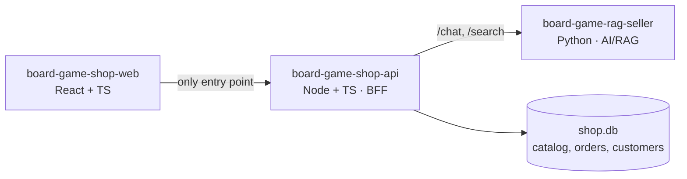

# board-game-shop-api — commerce backend (Node + TypeScript)

> Portfolio slice: a Node + TypeScript commerce BFF for the board-game storefront.
> The catalog, server-side cart and checkout flow are implemented and tested; the
> first AI-facing `/chat` proxy is in place; the remaining showcase work is generated
> web contracts, `/search`, purchase-history personalization and final polish.

The commerce backend of a small board-game e-commerce demo: products, orders,
customers — and the **BFF** (backend-for-frontend) in front of an AI advisor service.
It is one of three repositories that together form the storefront system:

| Repo | Role |
|---|---|
| [board-game-rag-seller](https://github.com/msporchia/board-game-rag-seller) | Python AI/RAG service — enrichment pipeline, hybrid search, conversational advisor (LangChain/LangGraph, Qdrant, Ollama) |
| **board-game-shop-api** (this repo) | Node commerce backend and BFF — products, orders, customers |
| [board-game-shop-web](https://github.com/msporchia/board-game-shop-web) | React storefront UI |

## Why this repo exists

The AI/RAG repo is the main research piece; this service is the deliberately
production-shaped Node/TypeScript slice around it. Its job is to show that the
system is not only a model demo:

- browser traffic enters through a typed BFF, not directly through the AI service;
- commerce data has a real owner: catalog, prices, carts, orders and history live here;
- every boundary is parsed at runtime, not trusted because TypeScript says so;
- the React app can consume emitted OpenAPI contracts instead of hand-maintained DTOs;
- the most interesting AI behavior comes from composition: the BFF injects real
  purchase history while the AI service stays ignorant of customer identity.

## The role this service plays

The browser talks **only** to this service. It owns the commerce domain and delegates
AI to the Python service — so service-to-service calls are real, not diagram fiction:



- **Products** — owned here: a catalog store in `shop.db`, seeded from a checked-in
  JSON snapshot of the same source that feeds the AI service's pipeline. How records
  flow between the two services long-term (the AI service pushes enriched records
  here, or this service feeds its records to the AI for enrichment) is an open
  question — see [PLAN.md](PLAN.md).
- **Orders & customers** — owned here (`shop.db`, SQLite), keyed by a client-generated
  `customer_id` (no auth — it's a demo identity).
- **Chat & search** — the next BFF slice: proxy the AI service, validate its responses,
  adapt contracts for the browser and inject the customer's **purchase history**
  (`customer_context`) into chat requests. That is where this repo earns its BFF
  title: cross-session personalization while the AI service stays ignorant of
  customer identity.

Database-per-service: this service never reads the AI service's stores, and vice
versa. Cross-domain needs travel through API calls.

## Current status

Implemented in this repo:

- Fastify app composition with Zod validation and OpenAPI emission.
- `GET /health`.
- `GET /products` and `GET /products/{id}` from the owned SQLite catalog.
- Catalog seeding from a legacy-shaped JSON snapshot.
- Server-side carts with server-computed money.
- Transactional checkout into order snapshots.
- Order history by customer.
- First `POST /chat` BFF proxy: browser-facing request, seller-facing call, seller
  response validation and buyable card enrichment from the shop catalog.
- `customer_context` injection from shop-owned order history: owned product ids and
  recent order summaries are built server-side, not accepted from the browser.
- Vitest coverage for config, stores, services and HTTP routes via `fastify.inject`.

Still intentionally open for the showcase:

- generated API types consumed by `board-game-shop-web`;
- seller-side use of `customer_context` for grounded personalization;
- `/search` passthrough to `board-game-rag-seller`;
- README screenshots/GIF once the chat-to-cart loop exists in the web app.

## Stack

| | Choice | Why |
|---|---|---|
| Runtime | Node 22 + Fastify | Modern, lean; the service's discipline is hand-applied, not framework-imposed (NestJS was the considered alternative) |
| Language | TypeScript strict | Contracts as code, mirroring the Python service's Pydantic discipline |
| Validation | Zod on every boundary | Parse untrusted data at runtime: HTTP inputs, env vars, seed files and future upstream AI responses |
| Contracts | OpenAPI emission | Route schemas emit the browser-facing contract; generated web types are the next showcase milestone |
| Storage | SQLite (`shop.db`, via `node:sqlite`) | Consistent with the ecosystem; zero native deps; swappable behind a store class |
| Tests | Vitest + `fastify.inject` | Route behavior tested against the HTTP contract, no live server |

## Showcase plan

- Repo coordination: [docs/cross-repo-showcase-plan.md](docs/cross-repo-showcase-plan.md).
- This repo's active checklist: [docs/showcase-checklist.md](docs/showcase-checklist.md).
- Phased roadmap: [PLAN.md](PLAN.md).

## Structure convention

Same rules as the Python service's `CLAUDE.md`, translated:

- **Folder = domain** (`catalog/`, `orders/`, `chat/`), not folder-by-type.
- **One class per file**; constructor injection for anything with behavior or I/O.
- **Route handlers never query** — they delegate to injectable domain classes.
- **Deep, explicit imports** — no barrel `index.ts` re-exports.

## Development

Requires Node 22. Install and run:

```bash
npm install            # install dependencies
npm run dev            # start with live reload (tsx watch) on :3000
curl localhost:3000/health   # { "status": "ok", "service": "board-game-shop-api" }
```

OpenAPI: Swagger UI at `/docs`, raw spec at `/docs/json` (derived from the zod
route schemas — no hand-maintained DTOs).

Quality gates (all run in CI):

```bash
npm test               # vitest (route + config tests, via fastify.inject)
npm run typecheck      # tsc --noEmit, strict
npm run lint           # eslint
npm run format:check   # prettier --check  (npm run format to fix)
npm run build          # tsc -> dist/ ; npm start runs node dist/main.js
```

Containerised dev: `docker compose up` builds the image and runs `npm run dev`
with the source bind-mounted. The compose service joins the seller stack's
network (`seller_default`, external) so it can reach the Python service and mock
catalog; it still starts standalone (`/health` has no upstream dependency) when
that stack is down.

Sibling checkouts expected: this repo next to `board-game-rag-seller` (which owns the
docker-compose stack — Qdrant, Ollama, mock catalog, AI service) and
`board-game-shop-web`. Standalone dev: `npm run dev` with env pointing at the running
seller stack. Full-stack orchestration: documented in the seller repo.
