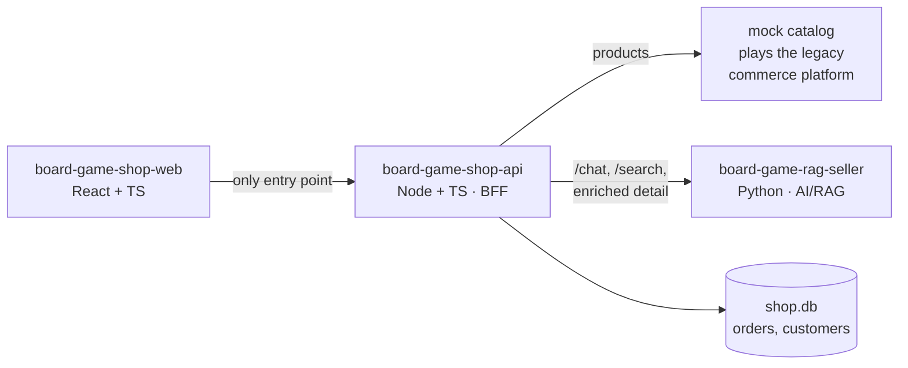

# board-game-shop-api — commerce backend (Node + TypeScript)

> 🚧 Planning stage. This repo will host the shop's backend service; for now it holds
> the service's intent and plan. See [PLAN.md](PLAN.md) for the phased roadmap.

The commerce backend of a small board-game e-commerce demo: products, orders,
customers — and the **BFF** (backend-for-frontend) in front of an AI advisor service.
It is one of three repositories that together form the storefront system:

| Repo | Role |
|---|---|
| [board-game-rag-seller](https://github.com/msporchia/board-game-rag-seller) | Python AI/RAG service — enrichment pipeline, hybrid search, conversational advisor (LangChain/LangGraph, Qdrant, Ollama) |
| **board-game-shop-api** (this repo) | Node commerce backend and BFF — products, orders, customers |
| [board-game-shop-web](https://github.com/msporchia/board-game-shop-web) | React storefront UI |

## The role this service plays

The browser talks **only** to this service. It owns the commerce domain and delegates
AI to the Python service — so service-to-service calls are real, not diagram fiction:



- **Products** — composed: base catalog from the upstream mock platform, enriched
  description fetched from the AI service.
- **Orders & customers** — owned here (`shop.db`, SQLite), keyed by a client-generated
  `customer_id` (no auth — it's a demo identity).
- **Chat & search** — proxied to the AI service. The chat proxy is where this service
  earns its BFF title: it injects the customer's **purchase history**
  (`customer_context`) into the chat request, enabling cross-session personalization
  ("buongiorno, ti sei divertito con Azul?") while the AI service stays ignorant of
  customer identity.

Database-per-service: this service never reads the AI service's stores, and vice
versa. Cross-domain needs travel through API calls.

## Stack

| | Choice | Why |
|---|---|---|
| Runtime | Node 22 + Fastify | Modern, lean; the service's discipline is hand-applied, not framework-imposed (NestJS was the considered alternative) |
| Language | TypeScript strict | Contracts as code, mirroring the Python service's Pydantic discipline |
| Validation | zod on every boundary | Parse, don't validate — inputs and upstream responses |
| Contracts | OpenAPI emission | The web app generates its client types from this spec; this service generates its AI-service client the same way. No hand-maintained DTO duplicates |
| Storage | SQLite (`shop.db`) | Consistent with the ecosystem; swappable behind a store class |
| Tests | Vitest + `fastify.inject` | Route behavior tested against the HTTP contract, no live server |

## Structure convention

Same rules as the Python service's `CLAUDE.md`, translated:

- **Folder = domain** (`catalog/`, `orders/`, `chat/`), not folder-by-type.
- **One class per file**; constructor injection for anything with behavior or I/O.
- **Route handlers never query** — they delegate to injectable domain classes.
- **Deep, explicit imports** — no barrel `index.ts` re-exports.

## Development

Requires Node 22. Install and run:

```bash
npm install            # install dependencies
npm run dev            # start with live reload (tsx watch) on :3000
curl localhost:3000/health   # { "status": "ok", "service": "board-game-shop-api" }
```

OpenAPI: Swagger UI at `/docs`, raw spec at `/docs/json` (derived from the zod
route schemas — no hand-maintained DTOs).

Quality gates (all run in CI):

```bash
npm test               # vitest (route + config tests, via fastify.inject)
npm run typecheck      # tsc --noEmit, strict
npm run lint           # eslint
npm run format:check   # prettier --check  (npm run format to fix)
npm run build          # tsc -> dist/ ; npm start runs node dist/main.js
```

Containerised dev: `docker compose up` builds the image and runs `npm run dev`
with the source bind-mounted. The compose service joins the seller stack's
network (`seller_default`, external) so it can reach the Python service and mock
catalog; it still starts standalone (`/health` has no upstream dependency) when
that stack is down.

Sibling checkouts expected: this repo next to `board-game-rag-seller` (which owns the
docker-compose stack — Qdrant, Ollama, mock catalog, AI service) and
`board-game-shop-web`. Standalone dev: `npm run dev` with env pointing at the running
seller stack. Full-stack orchestration: documented in the seller repo.
