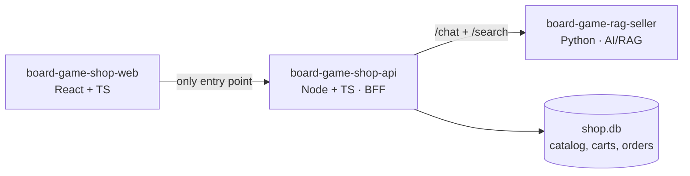
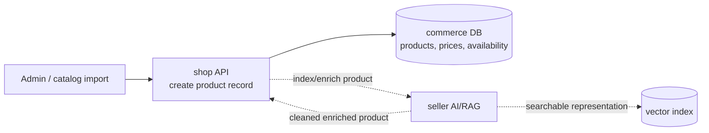
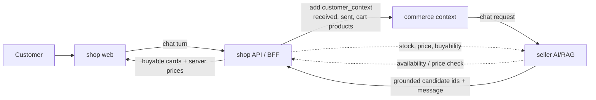

# board-game-shop-api — commerce backend (Node + TypeScript)

> A Node + TypeScript commerce BFF for the board-game storefront. The catalog,
> server-side cart and checkout flow are implemented and tested; the AI-facing `/chat`
> and `/search` proxies are in place. Remaining: real-stack verification with the web
> app, seller-side personalization and final polish.

The commerce backend of a small board-game e-commerce demo: products, orders,
customers — and the **BFF** (backend-for-frontend) in front of an AI advisor service.
It is one of three repositories that together form the storefront system:

| Repo | Role |
|---|---|
| [board-game-rag-seller](https://github.com/msporchia/board-game-rag-seller) | Python AI/RAG service — enrichment pipeline, hybrid search, conversational advisor (LangChain/LangGraph, Qdrant, Ollama) |
| **board-game-shop-api** (this repo) | Node commerce backend and BFF — products, orders, customers |
| [board-game-shop-web](https://github.com/msporchia/board-game-shop-web) | React storefront UI |

## Why this repo exists

The AI/RAG repo is the main research piece; this service is the production-shaped
Node/TypeScript slice around it. Its job is to show that the system is not only a
model demo:

- browser traffic enters through a typed BFF, not directly through the AI service;
- commerce data has a real owner: catalog, prices, carts, orders and history live here;
- every boundary is parsed at runtime, not trusted because TypeScript says so;
- the React app can consume emitted OpenAPI contracts instead of hand-maintained DTOs;
- the most interesting AI behavior comes from composition: the BFF injects real
  commerce context while the AI service stays ignorant of customer identity.

## The role this service plays

The browser talks **only** to this service. It owns the commerce domain and delegates
AI to the Python service — so service-to-service calls are real, not diagram fiction:



- **Products** — owned here: a catalog store in `shop.db`, seeded from a checked-in
  JSON snapshot of the same source that feeds the AI service's pipeline. In the
  production-shaped flow, this service creates the commerce record, asks seller to
  index/enrich it, and may accept cleaned AI-enriched fields back while remaining the
  source of truth.
- **Orders & customers** — owned here (`shop.db`, SQLite). Browser requests identify
  the active demo customer through `X-Customer-Id`; persisted rows are keyed by
  `customer_id`.
- **Chat** — the first AI-facing BFF route: the service proxies the AI advisor,
  validates its response, normalizes seller `id_product` candidates into browser-facing
  product ids, enriches them with shop-owned data and injects the customer's **commerce
  context** (`customer_context`). This is the BFF's core job: cross-session
  personalization while the AI service stays ignorant of customer identity.
- **Search** — a thin faceted passthrough to the seller service: the BFF validates the
  camelCase query/facet input, maps it 1:1 to seller's snake_case search contract,
  validates the returned hits and re-grounds each `id_product` into a buyable shop card
  with shop-owned price.

Database-per-service: this service never reads the AI service's stores, and vice
versa. Cross-domain needs travel through API calls.

## Normal production shape

The demo keeps the catalog simple, but the intended production ownership is clear:
the shop owns products, prices, availability, carts and orders; the seller owns AI
retrieval, enrichment and conversational strategy.

### Product ingestion and enrichment

In a normal store, product creation starts here. This service owns the commerce
record, then asks the seller service to index and enrich it. Seller may return a
cleaned version — better description, recovered facts, search text — but the commerce
record still belongs to the shop.



Dashed arrows are intentional future/production flows. In this demo the catalog is
seeded from `data/sample-catalog.json`, so product-write APIs and seller enrichment
callbacks were not needed.

### Sales and advisor flow

The browser never calls seller directly. The web sends the customer turn to this BFF;
the BFF adds commerce context (received products, sent products and cart products),
then asks seller for the advisor response. In a full production flow, seller would
also check back with this service before recommending a candidate, because only the
shop knows live stock, price and buyability.



In the current demo, the BFF already validates seller responses, drops candidate ids
that are not in its catalog, enriches returned ids with shop-owned product data, and
injects `customer_context` from stored orders and the current cart. Live stock is not
modeled yet, so the availability callback is documented as the normal production shape
rather than implemented code.

## Data ownership and storage

This service uses one owned SQLite database, `shop.db`, through Node's built-in
`node:sqlite` driver. It is intentionally small, local-first and easy to inspect, but
the code keeps it behind store/service classes so the persistence detail does not leak
into routes.

Owned data:

- `products` — shop-facing catalog records, seeded when empty from
  `data/sample-catalog.json`. The seed file is legacy-shaped, but legacy names are
  translated at the seed boundary and the API exposes camelCase product contracts.
- `cart_items` — server-side cart lines keyed by `customer_id` and `product_id`. The
  request source of truth is `X-Customer-Id`; the browser never computes prices or
  totals, it only renders the BFF response.
- `orders` and `order_items` — checkout snapshots. Names, prices, quantities and
  timestamps are copied at order time so later catalog changes do not rewrite history.

Demo tradeoffs are explicit: there is no auth, no payment, and no migration system.
Schema changes are wipe-and-reseed. That keeps the focus on TypeScript contracts,
runtime validation, BFF composition and transactional commerce behavior.

## Current status

Implemented in this repo:

- Fastify app composition with Zod validation and OpenAPI emission.
- `GET /health`.
- `GET /products` and `GET /products/{id}` from the owned SQLite catalog.
- Catalog seeding from a legacy-shaped JSON snapshot.
- Server-side carts with server-computed money.
- Transactional checkout into order snapshots.
- Order history by customer.
- Customer-scoped route identity via the required `X-Customer-Id` header; customer ids
  are not accepted in cart/order/chat paths, querystrings or request bodies.
- First `POST /chat` BFF proxy: browser-facing request, seller-facing call, seller
  response validation and buyable card enrichment from the shop catalog.
- `customer_context` injection from shop-owned state: received products, sent products
  and cart products are built server-side, not accepted from the browser.
- `GET /search` faceted passthrough: camelCase facets mapped to seller's search
  contract, hits validated and re-grounded into buyable shop cards.
- A single error handler so every non-2xx body matches one `{ error, message }`
  contract (validation `400`, upstream `502`, opaque `500`).
- OpenAPI export command and contract tests for the browser-facing route surface.
- Vitest coverage for config, stores, services and HTTP routes via `fastify.inject`,
  with the test suite type-checked under the same strict config as `src`.

Not yet done:

- real-stack verification that `board-game-shop-web` consumes the emitted OpenAPI
  contract cleanly against a running BFF;
- seller-side use of `customer_context` for grounded personalization;
- README screenshots/GIF once the chat-to-cart loop exists in the web app.

## Stack

| | Choice | Why |
|---|---|---|
| Runtime | Node 22 + Fastify | Modern, lean; the service's discipline is hand-applied, not framework-imposed (NestJS was the considered alternative) |
| Language | TypeScript strict | Contracts as code, mirroring the Python service's Pydantic discipline |
| Validation | Zod on every boundary | Parse untrusted data at runtime: HTTP inputs, env vars, seed files and future upstream AI responses |
| Contracts | OpenAPI emission | Route schemas emit the browser-facing contract; the web app generates types from this spec |
| Storage | SQLite (`shop.db`, via `node:sqlite`) | Consistent with the ecosystem; zero native deps; swappable behind a store class |
| Tests | Vitest + `fastify.inject` | Route behavior tested against the HTTP contract, no live server |

## How to review this repo

Start from the BFF boundaries:

1. Run the quality gates in the Development section.
2. Inspect the OpenAPI contract at `/docs/json` or with `npm run --silent openapi:print`.
3. Check customer-scoped routes: `X-Customer-Id` is required, while `/cart`, `/orders`
   and `/chat` contain no customer id in path/body/query.
4. Follow `POST /chat`: browser camelCase request in, seller snake_case request out,
   seller `id_product` results normalized back to buyable shop product cards.
5. Check the cart/order tests: prices and totals are always computed server-side, and
   checkout snapshots the order before clearing the cart.

## Structure convention

Same rules as the Python service's `CLAUDE.md`, translated:

- **Folder = domain** (`catalog/`, `orders/`, `chat/`), not folder-by-type.
- **One class per file**; constructor injection for anything with behavior or I/O.
- **Route handlers never query** — they delegate to injectable domain classes.
- **Deep, explicit imports** — no barrel `index.ts` re-exports.

## Development

Requires Node 22. Install and run:

```bash
npm install            # install dependencies
npm run dev            # start with live reload (tsx watch) on :3000
curl localhost:3000/health   # { "status": "ok", "service": "board-game-shop-api" }
```

OpenAPI: Swagger UI at `/docs`, raw spec at `/docs/json` (derived from the zod
route schemas — no hand-maintained DTOs).

For the React app, export the same contract without starting a server:

```bash
npm run --silent openapi:print    # writes clean OpenAPI JSON to stdout
npm run openapi:export            # writes ./openapi.json for local client generation
```

Quality gates (all run in CI):

```bash
npm test               # vitest (route + config tests, via fastify.inject)
npm run typecheck      # tsc --noEmit, strict
npm run lint           # eslint
npm run format:check   # prettier --check  (npm run format to fix)
npm run openapi:print  # emitted browser-facing API contract
npm run build          # tsc -> dist/ ; npm start runs node dist/main.js
```

Containerised dev: `docker compose up` builds the image and runs `npm run dev`
with the source bind-mounted. The compose service joins the seller stack's
network (`seller_default`, external) so it can reach the Python service and mock
catalog; it still starts standalone (`/health` has no upstream dependency) when
that stack is down.

Sibling checkouts expected: this repo next to `board-game-rag-seller` (which owns the
docker-compose stack — Qdrant, Ollama, mock catalog, AI service) and
`board-game-shop-web`. Standalone dev: `npm run dev` with env pointing at the running
seller stack. Full-stack orchestration: documented in the seller repo.
