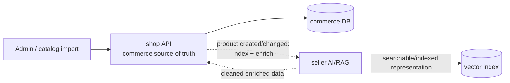
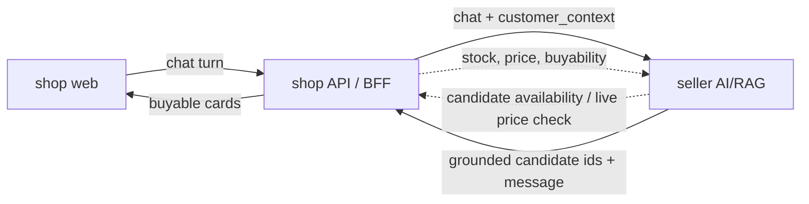

# Cross-repo showcase plan

This document coordinates the three repos as one portfolio project. The goal is not
to build a full e-commerce product; it is to show solid ownership across Python RAG,
Node/TypeScript backend work, and a React/TypeScript storefront.

## Showcase objective

One story:

> A customer browses a board-game shop, asks an AI advisor for help, adds a grounded
> recommendation to the cart, checks out, then sees the next advisor conversation
> change because the shop BFF injects real commerce context into the AI service.

What this proves:

- `seller`: production-shaped AI/RAG engineering, retrieval quality, eval discipline.
- `seller-shop`: Node + TypeScript backend/BFF, runtime validation, OpenAPI contracts,
  persistence, transactional commerce flows, service-to-service composition.
- `seller-web`: React + TypeScript storefront, typed API consumption, TanStack Query
  server state, cart/checkout/chat UX, end-to-end demo polish.

## Repo responsibilities

### seller

Owns AI and retrieval.

- Owns `/search` and `/chat` behavior.
- Owns RAG grounding, retrieval filters, session memory inside the AI service, evals.
- Will accept optional `customer_context` from the shop BFF, but does not own customer
  identity, carts, prices, or orders.
- Does not get called directly by the browser.

### seller-shop

Owns commerce and BFF composition.

- Owns catalog API, server-side carts, orders, price snapshots, order history.
- Owns the public browser-facing API and emitted OpenAPI spec.
- Validates every HTTP/env/file/upstream boundary with Zod or equivalent runtime
  parsing.
- Proxies `/chat` to `seller`; `/search` is the next thin passthrough.
- Injects commerce context into `/chat` as `customer_context`.
- Maps API style where useful: browser-facing contract can be camelCase; seller-facing
  contract can stay whatever `seller` already uses.

### seller-web

Owns the customer experience.

- Talks only to `seller-shop`.
- Generates/consumes API types from the BFF OpenAPI spec; feature contract files should
  re-export typed slices from the generated source, not redefine DTOs by hand.
- Renders catalog, product detail, cart, checkout, chat, recommendations, quick replies,
  and personalization effects.
- Never computes money or checkout totals.
- Keeps `customerId` and `chatSessionId` in localStorage for the demo identity; sends
  the active customer as `X-Customer-Id`.
- Owns the final full-stack smoke/e2e and screenshots/GIF used by the READMEs.

### Human/product owner

Keeps scope tight.

- Decides which visual details are worth polishing.
- Decides when the project is good enough for CV/portfolio use.
- Keeps the three READMEs telling the same story.

## Contract handshake

Contracts come before UI polish. If web needs a field, it should be added to the BFF
contract first, then consumed from generated types.

## Production-shaped flows beyond the demo

The current showcase uses a seeded catalog and no stock model. A real store would add
two dashed integration loops while keeping the same ownership boundaries:

Product ingestion/enrichment:



Sales/advisor flow:



- Product lifecycle: the shop owns the product record, then asks seller to index and
  enrich it. Seller can return cleaned/enriched fields, but it does not become the
  commerce source of truth.
- Recommendation lifecycle: seller should not assume a candidate can be sold. Either
  seller calls back to the shop for availability/price, or the BFF filters/enriches
  candidate ids before the browser sees them.
- Demo stance: this is documented, not built, because the portfolio slice is about the
  Node BFF, contract validation, cart/checkout ownership and chat-to-cart composition.

### Existing BFF surface

- `GET /health`
- `GET /products`
- `GET /products/{id}`
- `GET /cart`
- `PUT /cart/items/{productId}`
- `DELETE /cart/items/{productId}`
- `POST /orders`
- `GET /orders`
- `POST /chat`

Customer-scoped routes require `X-Customer-Id`; the customer id is not accepted in
paths, querystrings or request bodies.

### Current BFF chat contract

`POST /chat` is implemented in `seller-shop`. The browser sends `X-Customer-Id` plus
the current turn; the BFF derives `customer_context` internally from shop-owned state.

Browser-facing request:

```http
X-Customer-Id: demo-customer
```

```json
{
  "sessionId": "demo-chat-session",
  "message": "Cerco un cooperativo per due",
  "choices": ["max 30 minuti"],
  "k": 4
}
```

BFF behavior:

- validates request;
- reads received products, sent products and current cart products for `X-Customer-Id`;
- builds `customer_context` internally;
- forwards to `seller` `/chat`;
- validates seller response;
- normalizes seller `id_product` game hits into the browser-facing `id` contract;
- enriches returned game cards with shop-owned fields when needed: price, image, buyable
  product id;
- returns a stable web contract.

Browser-facing response:

```json
{
  "message": "Se giocate in due e volete collaborare, partirei da Pandemic...",
  "games": [
    {
      "id": 5,
      "name": "Pandemic",
      "image": "https://example.test/pandemic.jpg",
      "priceCents": 3650,
      "playersDisplay": "2-4",
      "durationMin": 45,
      "complexity": "Medio"
    }
  ],
  "quickReplies": ["max 30 minuti", "piu leggero", "un'altra idea"]
}
```

Seller-facing forwarded shape:

```json
{
  "session_id": "demo-chat-session",
  "message": "Cerco un cooperativo per due",
  "choices": ["max 30 minuti"],
  "k": 4,
  "customer_context": {
    "received_products": [3],
    "sent_products": [4, 5],
    "cart_products": [6, 9]
  }
}
```

The browser-facing OpenAPI contract deliberately does not expose `customer_context`; the
client cannot forge it.

### BFF route still missing

`GET /search`

- Thin passthrough to `seller`.
- Web owns URL-driven search state.
- BFF validates query/facets and maps names to seller's expected contract.

## What to polish for the showcase

1. Contract-first TypeScript loop

- BFF emits OpenAPI from Zod route schemas.
- Web generates types/client from that spec.
- Keep `seller-web/src/contracts` as generated OpenAPI types plus thin typed aliases;
  avoid hand-written DTO mirrors.

2. Chat to cart loop

- Chat panel renders recommendation cards.
- Recommendation card has an add-to-cart action.
- Add-to-cart invalidates/updates the server cart.
- User can complete checkout without losing the conversation.

3. Commerce-context personalization

- User buys a game.
- Next chat request includes received/sent/cart product ids from `seller-shop`.
- Advisor visibly changes behavior: received games are not recommended again, cart
  games are treated as already in-progress.
- Web makes the before/after visible.

4. Behind-the-scenes panel

Optional but high value for a portfolio demo.

- Small debug toggle in web, not prominent in the default UI.
- Shows what happened this turn: BFF injected `customer_context`, seller returned grounded
  game ids, quick replies became filters.
- This turns the demo from "nice UI" into "look at the architecture working".

5. README assets

- One screenshot of catalog/cart.
- One screenshot or GIF of chat recommendation to cart.
- One screenshot or short note showing post-purchase personalization.
- Each README links the other two repos and tells the same architecture story.

## Milestones

### Milestone 1: Make current state honest

Seller-shop:

- ✅ README no longer says "planning stage"; catalog, cart, orders, chat proxy,
  OpenAPI export and BFF-built commerce context are documented.
- ✅ Green quality gates and tested HTTP boundaries are documented.

Seller-web:

- ✅ README no longer says "planning stage"; catalog, product detail, cart, checkout,
  generated contracts, chat UI, identity switcher and demo recording are documented.
- ✅ Open items are explicit: real-stack chat verification, order history view,
  seller-side `customer_context` usage.

Both:

- ✅ Phase/status docs aligned enough for the current showcase pass.

### Milestone 2: Contract generation

Seller-shop:

- ✅ `/docs/json` is covered by contract tests.
- ✅ `npm run --silent openapi:print` and `npm run openapi:export` exist.

Seller-web:

- ✅ OpenAPI type generation exists (`npm run generate:api`).
- ✅ Feature contract files consume generated types.
- 🔶 MSW/e2e fixtures are close to the contract and should be checked during final
  real-stack verification.

Done when:

- The web cannot drift silently from the BFF contract.

### Milestone 3: Chat proxy MVP

Seller-shop:

- ✅ `POST /chat` implemented.
- ✅ Zod-validates browser request and seller response.
- ✅ Accepts seller `id_product` game hits and normalizes them to browser `id`.
- ✅ Forwards `session_id`, `message`, `choices`, `k` plus BFF-built
  `customer_context`.
- ✅ Returns camelCase `quickReplies` and buyable recommendation cards to web.

Seller-web:

- ✅ Chat panel with message list, input, quick replies and recommendation cards exists.
- ✅ Persists `chatSessionId`.
- ✅ Adds recommendations to cart.

Done when:

- A multi-turn chat works through browser -> BFF -> seller -> BFF -> browser.

### Milestone 4: Commerce context injection

Seller-shop:

- ✅ Builds `customer_context` from commerce state internally, not from the browser.
- ✅ Forwards `received_products`, `sent_products`, `cart_products`.
- ✅ Tests prove checkout/cart state changes the next chat payload.

Seller-web:

- 🔶 UI can send the chat turn and show recommendations; visible personalization waits
  for seller to actually consume `customer_context`.
- Keep the UI simple; the architectural effect is the star.

Done when:

- Buying Azul or adding it to cart can affect the next advisor turn in a visible,
  grounded way.

### Milestone 5: Showcase finish

Seller-web:

- Own full-stack Playwright smoke test.
- Produce screenshots/GIF.
- Polish layout, empty/error/loading states, keyboard basics.

Seller-shop:

- Tighten error handling, transaction behavior, DB parsing, test noise.
- Keep API docs and README crisp.

All repos:

- README story is consistent.
- Commands are reproducible from fresh checkout.

## Rules of collaboration between agents

- Web never calls `seller` directly.
- Web never computes prices, line totals, cart totals or order totals.
- Seller-shop never invents AI behavior; it validates, adapts and composes services.
- Seller never owns commerce identity or commerce state; it receives context from the BFF.
- Contract changes start in seller-shop, then web consumes them.
- If a field is only for UI display, still document whether it comes from shop-owned data or
  seller-owned data.
- Prefer one impressive vertical slice over many half-polished pages.

## Non-goals

- Real auth.
- Real payment.
- Full production migrations.
- Admin/backoffice.
- A huge design system.
- A complex product search UI before chat-to-cart works.
- Calling paid LLM APIs just to make the demo look better.
